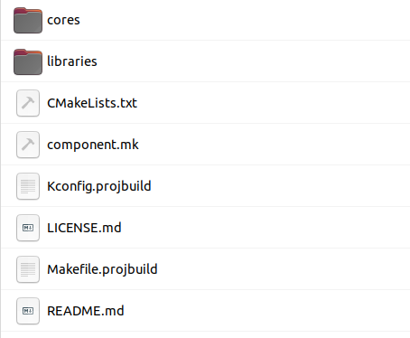
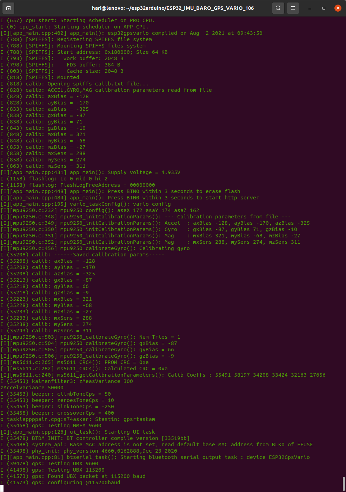
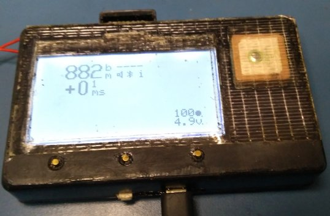
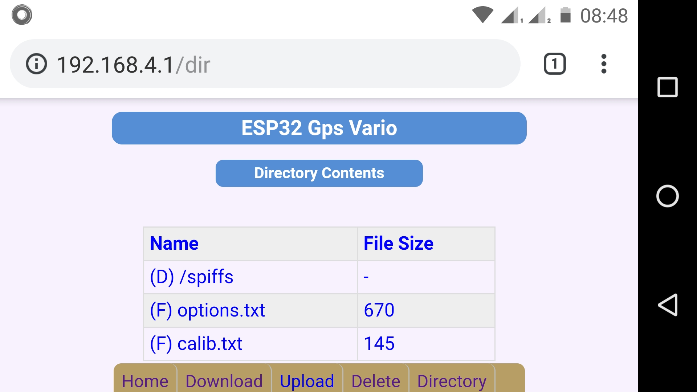
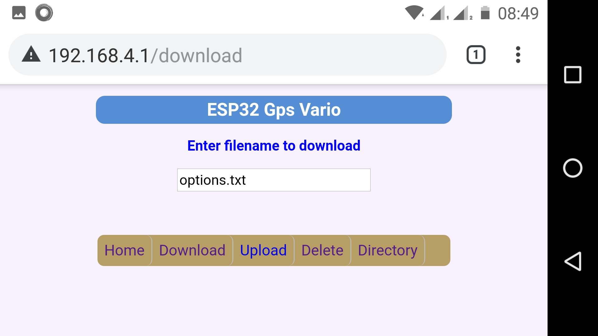

# ESP32 GPS Altimeter Variometer


* Variometer zero-lag response with a Kalman filter fusing acceleration data from an IMU module and altitude data from a barometric pressure sensor.
* High-speed data logging option for IMU (accelerometer, gyrosocope and magnetometer), barometer and gps 
readings. 500Hz for IMU data, 50Hz for barometric altitude data, and 10Hz for gps data. Data is logged to
a 128Mbit serial SPI flash. This is useful for offline analysis and development of data processing algorithms.
* Normal GPS track logging option with variable track interval from 1 to 60 seconds. Data is logged to a 
128Mbit serial SPI flash.
* Wifi access for downloading data or track logs and configuring user options. The unit acts as a Wifi
access point and web server. So you can access datalogs/configuration with a smartphone or laptop.
* Navigate a route with waypoints from one of up to 7 route files in FormatGEO .wpt format that were previously uploaded to the gpsvario.
* 128x64 LCD display of GPS or barometric altitude, climb/sink rate, distance from start/to waypoint, ground speed,
glide ratio, course-over-ground or compass heading, bearing to start/waypoint, time-of-day, elapsed-time, supply voltage, and speaker/data logging/bluetooth status.
* Variometer audio feedback uses the esp32 onboard DAC and external audio amplifier driving
an 8ohm cellphone speaker with sine-wave tones.
* Flight summaries (date, start time, start and end coordinates, duration, max altitude, max climb and sink rates) are stored as single line entries in the file `flightlog.txt` in the spiffs file system. This text file can be downloaded using wifi and opened in a spreadsheet (open as CSV file) for analysis.
* Bluetooth transmission of $LK8EX1 or $XCTRC NMEA sentences at a frequency of up to 10Hz. Validated with XCTrack on my Android phone.

# Build environment
* Ubuntu 20.04 amdx64
* ESP-IDF with Arduino-ESP32 as a component 
  * Arduino-ESP32 v1.06 
  * ESP-IDF v3.3.5
  * Toolchain v1.22.0-97

# Setting up build environment

This assumes the directory path for esp-idf + arduino-esp32 projects is `$ESPIDF_ARDUINO_PROJECTS_DIR`

1. Install esp-id v3.3.5<br>
   [Reference](https://docs.espressif.com/projects/esp-idf/en/v3.3.5/get-started-cmake/linux-setup.html) <br>
```
cd $ESPIDF_ARDUINO_PROJECTS_DIR
git clone -b v3.3.5 --recursive https://github.com/espressif/esp-idf.git
cd esp-idf
chmod 755 ./add_path.sh
```
2. Download and install the ESP32 compiler toolchain v1.22.0-97 compatible with esp-idf v3.3.5<br>
   [Reference](https://docs.espressif.com/projects/esp-idf/en/release-v3.2/get-started/linux-setup.html)<br>
```
cd $ESPIDF_ARDUINO_PROJECTS_DIR
tar -xzf ~/Downloads/xtensa-esp32-elf-linux64-1.22.0-97-gc752ad5-5.2.0.tar.gz
```
3. In `$ESPIDF_ARDUINO_PROJECTS_DIR`, create an executable script `setpath.sh` to export paths for esp-idf and tools, with the following contents<br>
```
export PATH="$ESPIDF_ARDUINO_PROJECTS_DIR/xtensa-esp32-elf/bin:$PATH"
export IDF_PATH="$ESPIDF_ARDUINO_PROJECTS_DIR/esp-idf"
$IDF_PATH/add_path.sh
```
4. Make script executable<br> 
```
chmod 755 ./setpath.sh
```
When you want to work with a esp-idf v3.3.5 + arduino-esp32 v1.06  project, open a terminal window and run `setpath.sh` 
```
cd $ARDUINO_ESP32_PROJECTS_DIR
. ./setpath.sh
```
5. Add Arduino-ESP32 v1.06 as a component in your esp-idf project. This step has already been done in the project code repository, but is described in case you want to build a esp-idf+arduino-esp32 project from scratch.<br>
   [Reference](https://docs.espressif.com/projects/arduino-esp32/en/latest/esp-idf_component.html) <br>
In your project top folder, run the following commands<br>
```
mkdir -p components
cd components
git clone --recursive https://github.com/espressif/arduino-esp32.git arduino
cd arduino
git checkout tags/1.0.6
```
Now you can delete the unnecessary directories in your project `components\arduino` folder. You should be left with the following directory contents : <br><br>
<br><br>
In the `components\arduino\libraries` folder, delete the SPIFFS library as we are using a different
version (see Credits below)<br><br>
6. From the project top level directory, run `make menuconfig` and ensure  the following settings : <br>
```
Arduino Configuration
    [ ] Autostart Arduino setup and loop on boot
    [*] Disable mutex locks for HAL
    Used partition scheme (No OTA (for large apps))
SPIFFS Configuration
    (0x180000) SPIFFS Base address
    (65536) SPIFFS Size in bytes
    (4096) SPIFFS logical block size
    (256) SPIFFS logical page size
Partition Table (Custom partition table CSV)
    (partitions.csv) Custom partition table
    (0x8000) Offset of partition table
Compiler Options
    [*] Enable C++ exceptions
Component config
    Bluetooth
        [*] Bluetooth
                Bluetooth controller mode (BR/EDR only)
        [*] Bluedroid Enable
ESP32-specific
    CPU frequency (80 MHz)
    (4096) Main task stack size
PHY
    (13) Max WiFi Tx power 9dBm)
FreeRTOS
    (200) Tick rate (Hz)
```   
7. Before flashing this project for the first time, run `make erase flash` once to ensure any existing partitions are wiped.   
8. Run `make flash monitor` to build the project, flash the ESP32 and start the console serial debug monitor. <br>
   Example log dump :
   
   <br><br>
   Boot Sequence to flight mode with no user interaction. This is indoors without GPS reception<br><br>
   <br>
   <br>
   <br>
   <br>
   <br>
   <br>
   <br>
   <br><br>
8. After ensuring everything is working as expected, you can delete the unnecessary library folders from `components\arduino\libraries`. For this project we only need to retain the following libraries : 
```
ESP32
FS
WiFi
```
You can prune these further by deleting the `/examples` sub-directory in each library folder.

# Hardware
* MPU9250 accelerometer+gyroscope+magnetometer sampled at 500Hz.
* MS5611 barometric pressure sensor, sampled at 50Hz.
* Ublox M8N gps module configured for 10Hz data rate with UBX binary protocol at 115200 baud.
I used a compact [ublox gps module from Banggood](docs/banggood_gpsmodule.jpg). Not a great choice - it was expensive, and 
it doesn't get a fix in my apartment, while cheaper modules with a larger patch antenna do get a fix. 
And it doesn't save configuration settings to flash, so it needs to be configured on every power-up.
I found [another gps module on Aliexpress](docs/aliexpress_gpsmodule.jpg) that is cheaper, has a larger patch antenna and flash configuration save. 
I don't have one myself, I'm assuming the advertising is correct :-D. 
We're using the highest fix rate possible (10Hz), for future integration into the imu-vario algorithm. 
Ublox documentation indicates that this is possible only when you restrict the module to the GPS constellation, rather than GPS+GLONASS etc. 
So don't waste your time looking for multi-constellation modules.
* Any commercial or homebrew ESP32 development board with an onboard USB-UART chip (CH340, CP2102 etc).
* W25Q128FVSG 128Mbit SPI flash
* 128x64 reflective LCD display (ST7565 controller) with SPI interface.
* For the power supply, I use a USB 5V output power bank. This allows me to 
detach the power bank and use it for other purposes, e.g. recharging my phone. And I can put 
my hand-wired gpsvario in checked-in luggage (no battery => no problem), with the power bank in my carry-on 
luggage as per airline requirements.
* Current draw from a 5V power bank is < 100mA in gpsvario mode with bluetooth transmission and volume set to 1, and < 150mA in wifi access point mode.
* I don't have a schematic for the project because I used  off-the-shelf modules. Have a look at the project file
`/main/config.h` to find the gpio pin <-> signal connections from the ESP32. The 
USB 5V pin supplies power for the GPS, MPU9250, MS5611, LCD modules (these modules have onboard 3.3V regulators) and audio amplifier. The
ESP32 VCC pin (3.3V) supplies power for the 128Mb SPI flash.  The LCD module PCB has a footprint for an
SOT23 type regulator. I soldered a 3.3V XC6203 regulator along with input and output bypass 10uF caps. All signal interfaces between the ESP32
and other components are at 3.3V level. 
* There are different versions of the 128x64 LCD module that may need 
modifications to the initialization code. See the `lcd_init()` function in `/ui/lcd7565.c`. You may have to choose a different option for lcd bias and display orientation. 
* I added a 1A resettable polyfuse and a 470uF 10V bypass capacitor on the USB 5V supply
before the power switch. Note that installing
a power switch requires breaking the 5V supply line from the microusb connector on the ESP32 breakout board.
The easiest way to do this is to desolder the schottky diode that is normally placed in the
5V supply line between the micro-usb connector 5V pin and the rest of the circuit. Connect the  polyfuse, capacitor to ground and power switch inline in its place.
* I am now using an [NS8002 module](docs/ns8002_pinout.jpg) for the audio amplifier . To avoid
overdriving the speaker, replace the 47K resistor with a 10k to 15k resistor.  You also need to pull up the mute/enable pin to
the 5V line with a 100k resistor.

# Usage
* There are 4 user-interface buttons labeled as btnL(eft), btnM(iddle) and btnR(ight), and btn0 (connected to gpio0). 
* The gyroscope is automatically calibrated each time on power up. The unit needs to be at rest (in any orientation) during gyro calibration. If it's disturbed, it will use the last saved gyro calibration values.
* You MUST calibrate the accelerometer and magnetometer correctly before using the gpsvario. 
* If there is no `calib.txt` file in the spiffs file system, the unit will prompt you for the calibration. If you want to recalibrate, you can delete the calib.txt file using the webserver access.
 Or you can manually force accelerometer and magnetometer calibration by pressing the btn0 button during the onscreen countdown to gyro calibration.  When you see the lcd display countdown for accelerometer calibration,
place the unit undisturbed on a flat horizontal surface, and wait until it completes. When you see the lcd display countdown for magnetometer calibration, pick up the unit and slowly and smoothly wave with a figure-of-8 motion while turning around 
and rotating the unit so that magnetometer readings can be obtained with all possible 3D orientations and compass headings. Keep doing this until calibration completes. Make sure you are several feet away from large metal objects. 
* For downloading binary data logs, put the gpsvario into server mode, connect to the WiFi access point `ESP32GpsVario` and access the url `http://192.168.4.1/datalog` via a web browser. The binary datalog file can contain a mix of high-speed IBG (imu+baro+gps) data samples, and normal GPS track logs. There is some sample software in the /offline directory for splitting the binary datalog into separate IBG and GPS datalogs, and for converting GPS logs into .gpx text files that you can load in Google Earth or other GPS track visualization software.
* For configuring the gpsvario, you can edit the user-configurable options on the LCD screen. In the options page, press the L or R buttons to select the option (cursor=o). Press the M button if you want to change the option (cursor=*). Now L and R will decrease/increase the value. Press the M button again to go back to the option select (cursor=o). Changes are saved to the file options.txt in the onboard SPIFFS flash file system. If there is no user activity for ~10 seconds on the option screen, the gpsvario will automatically transition into flight display mode. This is so that you can power up the unit and have it eventually start displaying the flight screen without user intervention. 
* Alternatively, put the gpsvario into server mode, access the url `http://192.168.4.1/dir` and download the `options.txt` file from the gpsvario. Edit it as required, and upload the file back to the gpsvario. Make sure you only edit the last field on each line ! This way you can keep different versions of the file on your laptop/smartphone for different sites or site conditions. To reset to 'factory defaults', just delete the `options.txt` file from the gpsvario using the webserver. It will be regenerated with default values the next time you power up the gpsvario. [Here's](docs/options.txt) a sample configuration file.<br><br>
<br><br>


* Every time the gpsvario is powered on, it sets the user-configurable data to default values and then overrides them with the values in `option.txt`. So you don't have to specify all the options in the file, only the ones you want to modify from 'factory default' values. 
* Use [xcplanner](https://xcplanner.appspot.com) to generate a route with waypoints in FormatGEO format as a *.wpt text file. Note that xcplanner does not specify waypoint radii in the FormatGEO file. You can edit the .wpt file to add the waypoint radius (in meters) at the end of each waypoint entry line. If the radius is not specified for a waypoint, the gpsvario will apply a user-configurable default waypoint radius. Upload the .wpt file to the gpsvario using the webpage upload file function. Ensure that the filename length is at most 20 characters or it will be ignored. You can upload up to 7 route files and select one of them (or none) on-screen. If there
are no route files or you select `none`, the bearing-to-waypoint arrow and distance-to-waypoint field will display bearing-to-start and distance-to-start position.
* In flight display mode, btnL toggles the heading display between GPS course-over-ground (direction of motion) and magnetic compass heading (direction the unit is facing). You will see the change reflected in the caret on top of the heading display - diamond for compass heading, bar for GPS course heading. For low velocities (< 2kph), the GPS course heading display is blanked out, as
the uncertainty in direction is high.
* In flight display mode, if you selected high-speed IBG data logging, btnM toggles data logging on and off. The display will show `I` if logging, `i` if not logging. 
Bear in mind that if you turn on IBG data logging, the 128Mb flash will be filled up in approximately 13minutes ! If the flash is full, logging stops.
* In flight display mode, if you selected GPS track logging, the display will show `G` if track logging is active, `g` if track logging is inactive. Track logging will be activated
when you have moved a user-configurable distance from your start position. Your start position will be fixed when the GPS Dilution of Precision (DOP) value goes below a user configurable threshold (the GPS has a good position fix). For logging options GPS or NONE, btnM has no effect. 
* In flight display mode, btnR toggles the audio on and off. You will see a speaker icon if audio is enabled. 
* Either barometric pressure altitude (aka airspace altitude, assumes sea-level pressure = 101325Pa) or GPS altitude can be displayed on the primary altitude display. If you select barometric altitude for the primary display, the field will show `bm` and the secondary altitude field will show GPS altitude. If you
select GPS altitude for the primary display, the field will show `gm` and the secondary field will show barometric altitude. If the GPS DOP is high,
 GPS altitude will be displayed as `----`.  When the GPS fix is good (enough satellites in view with a good signal), the GPS altitude will be stable and fairly close to the barometric
altitude (+/-100m). Barometric pressure altitude depends on atmospheric conditions - higher in unstable low-pressure conditions, lower in stable high-pressure conditions.
GPS DOP is displayed as a number on the lower right, just above the supply voltage, with a maximum value of 100. A good DOP value should be around 5 or less. This might take a couple of minutes after power up. If your GPS module has a battery backup to retain satellite ephemeris data for your location, you can get a good hot-start fix in a few seconds.
* The glide ratio field displays `+` when climbing and is clamped to a maximum of 99.9 when gliding. There is a damping filter to reduce jitter in the
computed value using an IIR recursive filter. The highest damping value is 99. Recommended value is ~90.
* When connecting a navigation app (e.g. XCTrack) via bluetooth, the gpsvario device name is `Esp32GpsVario`. You can  transmit periodic $LK8EX1 or $XCTRC NMEA messages, at up to 10Hz. XCTrack applies heavy damping filters to external data such as
climbrate or altitude. You will see faster response on the XCTrack display if you increase the frequency of NMEA messages. 
* $LK8EX1 messages only contain barometric data ( pressure/altitude, climbrate) and power supply voltage. If you set bluetooth message type to LK8, ensure that `Use external gps` option is disabled and `Use external barometer` is enabled in the XCTrack preferences page.
* $XCTRC messages include GPS coordinates, GPS altitude, UTC date and time, and battery charge percent. If you set bluetooth message type to XCT, and you want XCTrack to use GPS data from the gpsvario, ensure both `Use external barometer` and `Use external gps` are enabled in the XCTrack preferences page.  
* To disable bluetooth transmission, set the bluetooth message frequency to 0Hz.

# Credits
* SPIFFS code - https://github.com/loboris/ESP32_spiffs_example
* Sine-wave generation with ESP32 DAC -  https://github.com/krzychb/dac-cosine
* Web server library - https://github.com/Pedroalbuquerque/ESP32WebServer
* Web server top level page handling, css style modified from  https://github.com/G6EJD/ESP32-ESP8266-File-Download-Upload-Delete-Stream-and-Directory
* MPU9250 initialization sequence modified from https://github.com/bolderflight/MPU9250/blob/master/MPU9250.cpp


