# ESP32 GPS Altimeter Variometer

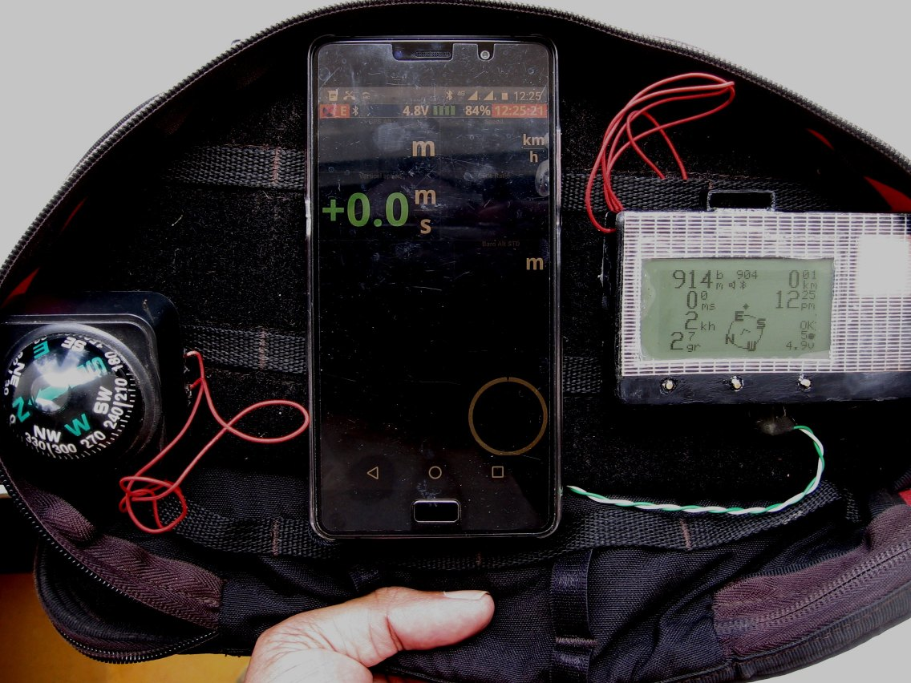

* Variometer features zero-lag response : a Kalman filter fuses earth-Z acceleration data from an IMU sensor and altitude data from a barometric pressure sensor.
* High-speed data logging option for IMU sensor (accelerometer, gyrosocope and magnetometer), barometer and gps 
readings. 500Hz for IMU data, 50Hz for barometric altitude data, and 10Hz for gps data. Data is logged to
a 128Mbit serial SPI flash. This is useful for offline analysis and development of data processing algorithms.
* Normal GPS track logging option with variable track interval from 1 to 60 seconds. Data is logged to a 
128Mbit serial SPI flash.
* Wifi access for downloading data or track logs and configuring user options. The unit acts as a Wifi
access point and web server. So you can access datalogs/configuration with a smartphone or laptop.
* Navigate a route with waypoints from one of up to 7 route files in **FormatGEO** .wpt format that were previously uploaded to the gpsvario.
* 128x64 LCD display of 
  * GPS and barometric altitude
  * Climb / sink rate
  * Distance-from-start / distance-to-waypoint
  * Ground speed
  * Glide ratio
  * Course-over-ground / magnetic compass heading
  * Bearing-to-start / bearing-to-waypoint
  * Time-of-day
  * Elapsed time
  * GPS Dilution of Precision (DOP)
  * Supply voltage
  * Status icons for vario audio feedback, data logging, bluetooth
* Variometer audio feedback uses the esp32 DAC and external audio amplifier driving
an 8ohm cellphone speaker with sine-wave tones.
* Flight summaries are stored as single line entries in the file `flightlog.txt`. The flight summary has flight date, start time, start and end coordinates, duration, max altitude, max climb and sink rates. This text file can be downloaded using WiFi and opened in a spreadsheet for analysis (open as CSV file).
* Bluetooth transmission of `$LK8EX1` or `$XCTRC` NMEA sentences at a frequency of up to 10Hz. Validated with **XCTrack** app on my Android phone.

# Changes from release v1.0
* Build environment changed to Visual Studio Code + PlatformIO plugin
* Uses arduino framework instead of esp-idf with arduino-esp32 as a component
* Works with latest arduino-esp32 master on Github (v2.00-rc1 instead of v1.06)
* All source code refactored as C++ files (trivial changes)
* Uses Arduino LittleFS library
* WiFi configuration webpage server uses asynchronous  Arduino **ESP32AsyncServer** library instead of blocking code.
* Root **index.html** page and **style.css** files are served from a LittleFS partition instead of being embedded in the source code. These two files are in the `/data` project directory. You can modify the
appearance of the web page by editing these files, re-building and uploading the LittleFS partition binary image (see below).
* Bluetooth NMEA sentence transmission now uses the Arduino **BluetoothSerial** library.
* Support for OTA firmware updates via WiFi.
  
# Build environment
* Ubuntu 20.04 amdx64
* Visual Studio Code + PlatformIO using Espressif ESP32 platform **esp32dev** with **arduino** framework.
* The file **platformio.ini** specifies the ESP-IDF, arduino-esp32 and library dependencies.
* [Tutorial for setting up VSC+PlatformIO](https://randomnerdtutorials.com/vs-code-platformio-ide-esp32-esp8266-arduino/)

# Setting up build environment

The previous repository release v1.0 required a complex build setup with esp-idf v3.3.5 and arduino-esp32 v1.06.

The new build environment is much easier to set up and use. PlatformIO takes care of generating a suitable build environment after you have specified framework and library dependencies in the file **platformio.ini**. For reference,
it's now using the **arduino-esp32** master release on Github (v2.00-rc1 as of this update), and a PlatformIO Espressif ESP32 SDK compatible with this framework.

Before flashing this project for the first time, run **Erase Flash** in the PlatformIO **PROJECT TASKS > esp32dev > Platform** dropdown menu. This is to ensure any existing partitions on the ESP32 are wiped.

Run **Build Filesystem Image**. This will generate a LittleFS binary image from the files contained in the `/data` sub-directory. The project repository `/data` directory includes :
* webserver root html page `index.html` and `style.css` files. (required)
* example `options.txt` file for configuring the gpsvario. (optional)
* example route file with waypoints in **FormatGEO** format. (optional)
  
Run **Upload Filesystem Image**. This will flash the LittleFS partition binary image to the LittleFS partition address specified in `partitions.csv`.
This step needs to be executed again only if you change the contents of the project `/data` sub-directory.

From the PlatformIO **PROJECT TASKS > esp32dev > General** menu, run  **Clean** and then **Build**. This will generate the firmware application binary `firmware.bin` in the project `.pio/build/esp32dev` directory.

Run **Upload and Monitor**. 

You will be prompted to calibrate the accelerometer, magnetometer and gyroscope (see Usage section below). Calibration parameters are saved to the file `calib.txt`.

Example Visual Studio Code screenshot of the debug log after running **Upload and Monitor** :

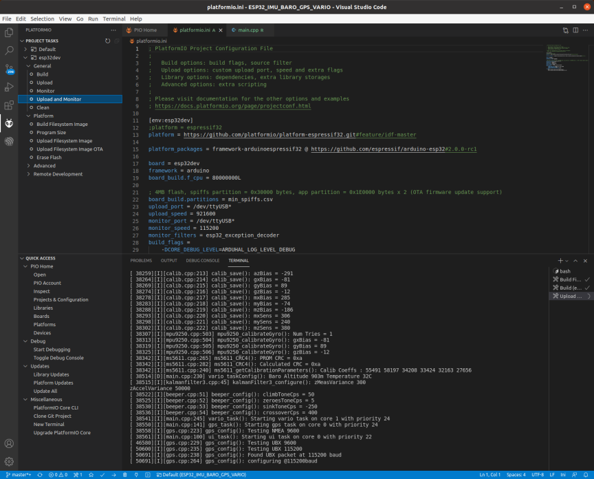
   
Startup sequence to flight mode with no user interaction. This is indoors without GPS reception.

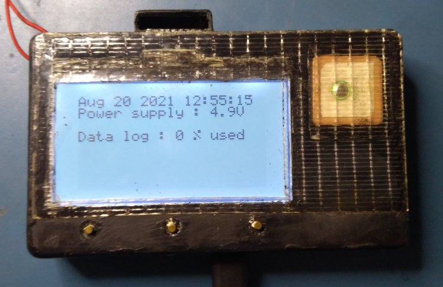

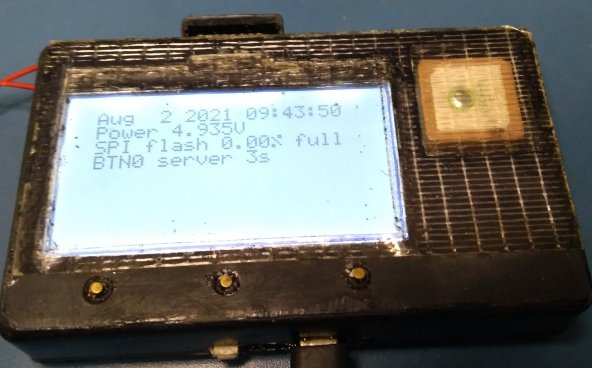

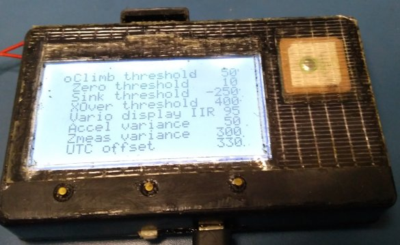

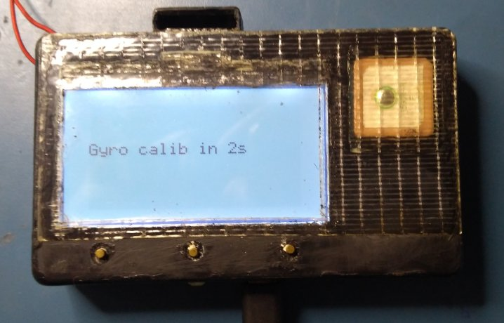

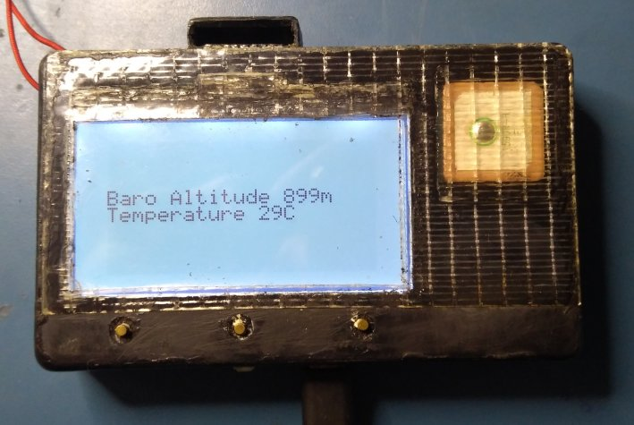

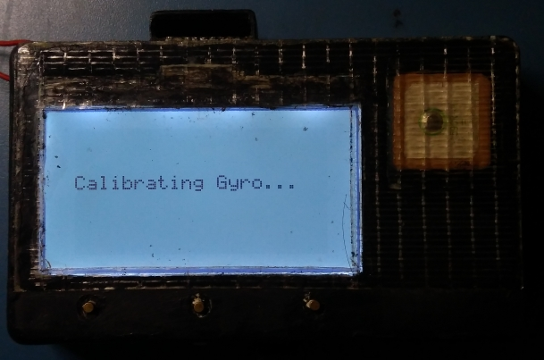
   
# Hardware
* MPU9250 accelerometer+gyroscope+magnetometer sampled at 500Hz.
* MS5611 barometric pressure sensor, sampled at 50Hz.
* Ublox M8N gps module configured for 10Hz data rate with UBX binary protocol at 115200 baud.
I used a compact [ublox gps module from Banggood](docs/banggood_gpsmodule.jpg). Not a great choice - it was expensive, and 
it doesn't get a fix in my apartment, while cheaper modules with a larger patch antenna do get a fix. 
And it doesn't save configuration settings to flash, so it needs to be configured on every power-up.
I found [another gps module on Aliexpress](docs/aliexpress_gpsmodule.jpg) that is cheaper, has a larger patch antenna and flash configuration save. 
I don't have one myself, I'm assuming the advertising is correct :-D. 
We're using the highest fix rate possible (10Hz), for future integration into the imu-vario algorithm. 
Ublox documentation indicates that this is possible only when you restrict the module to the GPS constellation, rather than GPS+GLONASS etc. 
So don't waste your time looking for multi-constellation modules.
* Any commercial or homebrew ESP32 development board with an onboard USB-UART chip (CH340, CP2102 etc).
* W25Q128FVSG 128Mbit (16Mbytes) SPI flash for storing data / track logs.
* 128x64 reflective LCD display (ST7565 controller) with SPI interface.
* For the power supply, I use a USB 5V output power bank. This allows me to 
detach the power bank and use it for other purposes, e.g. recharging my phone. And I can put 
my hand-wired gpsvario in checked-in luggage (no battery => no problem), with the power bank in my carry-on 
luggage as per airline requirements.
* Current draw from a 5V power bank is < 100mA in gpsvario mode with bluetooth transmission and volume set to 1, and < 150mA in wifi access point mode.
* I don't have a circuit schematic because I used  off-the-shelf modules. 
  * The project file `/include/config.h` defines all ESP32 gpio pin <> sensor interface connections. 
  * The USB 5V pin supplies power for the GPS, MPU9250, MS5611 and LCD modules. These modules have onboard 3.3V regulators.
  * The LCD module PCB has a footprint for an SOT23 type regulator. I soldered a 3.3V XC6203 regulator along with input and output bypass 10uF caps. 
  * The USB 5V pin supplies power to the NS8002 audio amplifier. 
  * The ESP32 VCC pin (3.3V) supplies power for the 128Mb SPI flash.  
  * Signal interfaces between the ESP32 and other components are at 3.3V level. The exception is the NS8002 amplifier - the enable/shutdown pin is pulled up to 5V with a 100K resistor. The ESP32 gpio pin enabling the NS8002 is configured as output open-drain (external pullup).
* There are different versions of the 128x64 LCD module that may need 
modifications to the initialization code. See the `lcd_init()` function in `/ui/lcd7565.c`. You may have to choose a different option for lcd bias and display orientation. 
* I added a 0.5A resettable polyfuse and a 470uF 10V bypass capacitor on the USB 5V supply
before the power switch. 
The easiest way to do this is to desolder the schottky diode that is normally placed between the ESP32 dev board micro-usb connector 5V pin and the rest of the circuit. Connect the  polyfuse, capacitor to ground and power switch in its place.
* I am now using an [NS8002 module](docs/ns8002_pinout.jpg) for the audio amplifier . To avoid
overdriving the speaker, replace the 47K resistor with a 10k to 15k resistor.  You also need to pull up the mute/enable pin to
the 5V line with a 100k resistor.

# Usage
## Buttons
  There are 4 user-interface buttons labeled as 
  * btnL
  * btnM
  * btnR
  * btn0
  
## Calibration 
* The gyroscope is automatically calibrated each time on power up. When you see the prompt for gyro calibration, make sure the gpsvario is stationary (in any orientation). If it's disturbed, it will use the last saved gyro calibration values.
* You MUST calibrate the accelerometer and magnetometer correctly before using the gpsvario. 
* If there is no `calib.txt` file found, the unit will prompt you to calibrate the IMU sensors and then save the file. If you want to force re-calibration, you can delete `calib.txt`  using the webserver access, and then reboot the unit.
* You can also force accelerometer and magnetometer calibration by pressing **btn0**  during the on-screen countdown to gyro calibration.  
* When you see the LCD display countdown for **accelerometer calibration**, place the gpsvario undisturbed on a flat **horizontal** surface, and wait until it completes. 
* When you see the LCD display countdown for **magnetometer calibration**, [pick up the gpsvario and _slowly and smoothly_ wave your hand with a 3D figure-of-8 motion](https://calibratecompass.com/) while you simultaneously turn around 360 degrees. Magnetometer calibration requires readings with all possible 3D orientations and compass headings. Keep doing this until calibration completes. Make sure you are several feet away from large metal objects. 

## WiFi Configuration webpage
* Switch on the gpsvario, press **btn0** when you see the prompt for  server mode. 
* Connect to the WiFi access point `Esp32GpsVario`
* Open a web browser and enter the url `http://esp32.local`
* The webpage is protected by user and password access. Username = **admin**, default
password = **admin**. If you want to use a different user name and password, edit the values for `default_httpuser`
and `default_httppassword` in the file `async_server.cpp`.

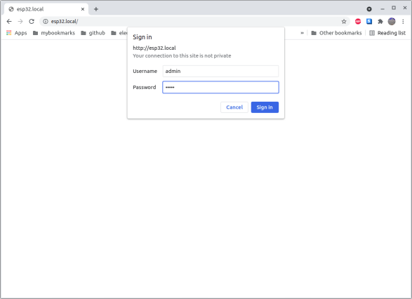

* The firmware can optinally be built to connect as a station to an existing external WiFi access point. This is not much use in the field. But if you only plan to configure the gpsvario at home, it is a viable option. In this case, 
  * Uncomment `#define STATION_WEBSERVER` at the top of `async_server.cpp`. 
  * Specify the external WiFi Access Point SSID and password in the variables `default_ssid` and `default_wifipassword`. 
  * Re-build and flash the firmware.
  
 * Click on the **Directory** button to get a listing of files in the LittleFS partition. Note that the webpage `index.html` and `style.css` files are hidden.
 * You can upload new files, e.g. route files with waypoints, using the **Upload File** button. Any file not ending with a `.bin` suffix will be uploaded to the LittleFS partition. Please ensure that there is sufficient free space in the partition **before** you upload the file. There is no working check to see if the uploaded file will fit in the free space.
 * For firmware updates, use the **Upload File** button. 
   * If you select a `.bin` file, it is assumed to be a firmware application binary  and will be uploaded to the OTA flash partition. 
   * On upload completion, the gpsvario will automatically reboot with the new firmware. 
   * Verify the new firmware build time stamp on the LCD boot screen. 
   * The firmware build timestamp is also shown on the webpage header. Make sure you flush the web browser cache so the updated webpage is shown.

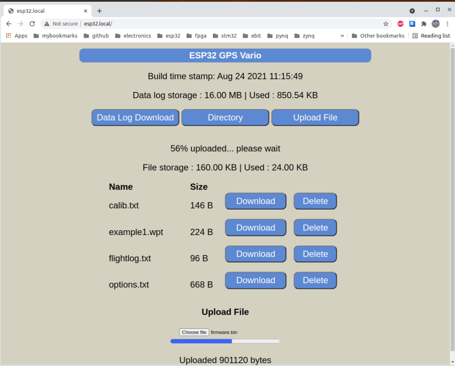
  
## Downloading the data log
* To download the data log, put the gpsvario in WiFi configuration mode and access the webpage as above.
* Click on the **Data Log Download** button to download the log as a binary file `datalog`. You can also download the datalog by accessing the url `http://esp32.local/datalog`.
* The file can contain a mix of high-speed IBG (imu+baro+gps) data samples, and normal GPS track logs. 
* There is some sample software in the project `/offline` directory for splitting the downloaded data log file into separate IBG and GPS data log files, and for converting GPS log files into `.gpx` track files. You can visualize `.gpx` tracks in Google Earth or other online GPS track visualization software.
  
## User options
* To configure the gpsvario, you can change user-configurable options in the options screen on the LCD display.
* In the options screen, press the **btnL** or **btnR** buttons to select the option (cursor= empty circle). 
* Press the **btnM** button if you want to change the selected option (cursor -> solid circle). 
* Now **btnL** and **btnR** will decrease/increase the value. Press the **btnM** button again to go back to the option select (cursor = empty circle). 
* Click on **btn0** to exit the options page when done. 
* Configuration options are saved to the file `options.txt`. 
* If there is no user activity for ~10 seconds in the options screen, the gpsvario will automatically transition into flight display mode. This is so that you can power up the unit and have it eventually start displaying the flight screen without user intervention. 
* You can also configure the gpsvario by replacing the `options.txt` file. 
  * Switch on the gpsvario, select server mode, access the url `http://esp32.local`
  * Click on **Directory** and download `options.txt` file.
  * Edit options as required. _Make sure you only change the last field on a line_.  
  * Upload the modified `options.txt` file back to the gpsvario.
  * This way you can keep different versions of `options.txt` file on your laptop/smartphone for different sites or site conditions. 
* To reset to 'factory defaults', delete `options.txt`. It will be regenerated with default values the next time you power up the gpsvario. Default values are in the file `/include/config.h`. Search for the `USER-CONFIGURABLE PARAMETER DEFAULTS` section.
* [This is an example](docs/options.txt) of an `options.txt` file.
* Every time the gpsvario is powered on, it sets all user-configurable parameters to default values and then overrides them with values found in the file `options.txt`. So you don't have to specify all options, only the ones you want to modify from the default values. 
  
## Routes
* Use [**xcplanner**](https://github.com/dkm/xcplanner) to generate a route with waypoints in **FormatGEO** format as a `.wpt` text file. 
* Note that **xcplanner** does not specify waypoint radii in the **FormatGEO** file. Edit the `.wpt` file to add the waypoint radius (in meters) at the end of each waypoint entry line. 
If you do not specify the radius for a waypoint, the gpsvario will apply a user-configurable default waypoint radius. 
* Upload the `.wpt` file to the gpsvario using the webpage upload file function. Ensure that the filename length is at most 20 characters or it will be ignored. 
* You can upload up to 7 route files and select one of them (or none) on-screen. 
* If there are no route files or you select `none`, the **bearing-to-waypoint** arrow will display bearing to start position, and the **distance-to-waypoint** field will display distance to start position.
  
## Heading display
* In the flight display screen, **btnL** toggles the heading display between GPS course-over-ground (direction of motion) and magnetic compass heading (direction the unit is facing). 
* You will see the change reflected in the caret on top of the heading display. The caret is a **diamond** for compass heading, **bar** for GPS course heading. 
* For low ground speeds (< 2kph), the GPS course heading display is blanked out, as
the uncertainty in direction is high.

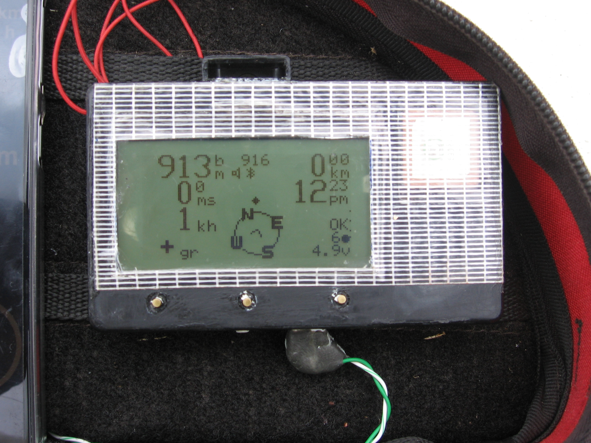

## IMU data or GPS track logging
* In the flight display screen, if you previously selected high-speed IBG data logging, **btnM** toggles data logging on and off. The display will show `I` if logging, `i` if not logging. 
* Bear in mind that if you turn on IBG data logging, the 128Mb flash will be filled up in approximately 13 minutes! When the flash is full, logging stops.
* In the flight display screen, if you previously selected GPS track logging, the display will show `G` if track logging is active, `g` if track logging is inactive. 
* GPS track logging will be activated when you have moved a user-configurable distance from your start position. 
* Your start position will be fixed when the GPS Dilution of Precision (DOP) value goes below a user configurable threshold (i.e., the GPS has a good position fix). 
* For logging options `GPS` or `NONE`, **btnM** has no effect, i.e. you cannot toggle GPS tracking on and off, it is automatically activated as described above. 
* Press **btn0** at the end of a flight. If you have enabled GPS track logging, it will stop. The LCD screen will display a flight summary.
## Vario audio mute  
* In flight display mode, **btnR** toggles the audio on and off. You will see a speaker icon if audio is enabled. 
## Altitude display
* Either barometric pressure altitude  or GPS altitude can be displayed on the primary altitude display. 
* The barometric altitude display assumes sea-level pressure = 101325Pa. This is `pressure altitude`, a.k.a. `airspace altitude`.
* Barometric pressure altitude depends on atmospheric conditions. It will be higher in unstable low-pressure conditions, and lower in stable high-pressure conditions.
* In the options screen, if you selected barometric altitude for display, the primary altitude field will have `bm` units, and the secondary altitude field will show GPS altitude. 
* If you selected GPS altitude for display, the primary altitude field will have `gm` units, and the secondary field will show barometric altitude. 
* When there are enough satellites in view with a good signal and a good 'geometry' w.r.t. your position, you can get a good 3D position fix. The GPS DOP will be low, GPS altitude will be stable and fairly close to the barometric altitude (+/-100m). 
* If the GPS DOP is high, GPS altitude will be displayed as `----`.  
* GPS DOP is displayed as a number on the lower right, just above the supply voltage, with a maximum value of 100. 
* A good DOP value is <= 5 with the GPS module I used. This might take a couple of minutes after power-up in a new location. 
* If your GPS module has a battery backup to retain satellite ephemeris data for your location, you can get a good hot-start fix in a few seconds.
  
## Glide Ratio
* Glide ratio = horizontal speed over ground / vertical sink rate.
* The `glide ratio` display is clamped to a maximum of `99.9` when gliding. 
* The `glide ratio` field displays `+` when ascending.
* A damping IIR filter reduces jitter in the
displayed glide ratio. The highest damping value is 99. Recommended range is 90-95.

## Bluetooth NMEA messages
* To enable Bluetooth transmission of NMEA sentences, set the bluetooth message frequency to a value between `1Hz` and `10Hz` in the options screen. 
* If you select `0Hz`, bluetooth transmission is disabled.
* The gpsvario Bluetooth device name is `Esp32GpsVario`. 
* You can  transmit periodic `$LK8EX1` or `$XCTRC` NMEA sentencess, at rates of 1Hz to 10Hz. 
* Navigation apps such as **XCTrack** apply heavy damping filters to external data. You will see faster response on the **XCTrack** display if you increase the frequency of NMEA sentences (max 10Hz). 
* `$LK8EX1` sentences only contain barometric pressure-derived data (pressure, altitude, climbrate) and gpsvario power supply voltage. 
* If you set bluetooth message type to `LK8` in the options screen, ensure that `Use external gps` option is disabled and `Use external barometer` is enabled in the **XCTrack** preferences page.
* `$XCTRC` sentences additionally include GPS coordinates, GPS altitude, UTC date and time, and battery charge percent. 
* If you set bluetooth message type to `XCT` in the options screen, and you want **XCTrack** to use GPS data from the gpsvario, ensure both `Use external barometer` and `Use external gps` are enabled in the **XCTrack** preferences page.  

# Credits
* Sine-wave generation with ESP32 DAC -  https://github.com/krzychb/dac-cosine
* MPU9250 initialization sequence modified from https://github.com/bolderflight/MPU9250/blob/master/MPU9250.cpp
* https://github.com/smford/esp32-asyncwebserver-fileupload-example
* https://randomnerdtutorials.com/esp32-web-server-spiffs-spi-flash-file-system/

